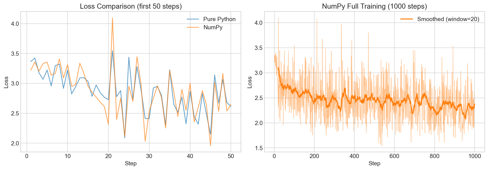
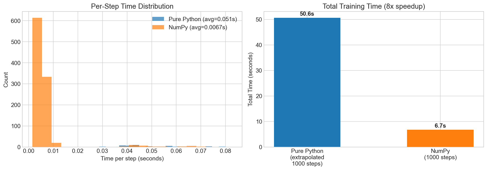

# 2. Vectorise with NumPy

## What We Do Here

In [Step 1](../1.%20microgpt/), we built a complete GPT from scratch using **pure Python** — every operation was a scalar `Value` object, linear algebra was done via nested list comprehensions, and autograd tracked individual float multiplications and additions.

In this step, we replace all of that scalar Python with **NumPy array operations**. The architecture stays identical:

- `n_embd=16`, `n_head=4`, `n_layer=1`, `block_size=16`
- Character-level tokenizer on a names dataset (32K names)
- Hand-rolled autograd + Adam optimizer
- Same training loop, same KV-cache inference

The only change is **how** the math is computed:

| Operation | Pure Python (Step 1) | NumPy (Step 2) |
|-----------|---------------------|----------------|
| Linear layer | `[sum(wi*xi for wi,xi in zip(wo,x)) for wo in w]` | `w.data @ x.data` (single matmul) |
| Autograd unit | `Value` (wraps a single `float`) | `Tensor` (wraps a `numpy.ndarray`) |
| Parameter storage | `list[list[Value]]` (2D list of scalars) | `Tensor` with shape `(Dout, Din)` |
| Gradient accumulation | `p.grad += local_grad * v.grad` (scalar) | `p.grad += np.outer(out.grad, x.data)` (array) |
| Softmax | Loop over list of `Value` objects | Single array `exp()` / `sum()` |
| RMSNorm | `sum(xi*xi for xi in x) / len(x)` | `(x * x).mean()` |

## How It Improved

### Performance Results

| Metric | Pure Python | NumPy | Improvement |
|--------|------------|-------|-------------|
| Avg time per step | ~51ms | ~6.7ms | **~8x faster** |
| 1000 steps (total) | ~51s | ~6.7s | **~8x faster** |
| Final loss (1000 steps) | — | 2.61 | Converges well |
| Parameters | 4,192 | 4,192 | Identical |

### Loss Curves

Both implementations converge at the same rate (same model, same data, same algorithm):



Left: first 50 steps compared side by side. Right: full 1000-step numpy training.

### Time Comparison



The histogram shows per-step times. NumPy steps cluster tightly around 5-7ms, while pure Python steps are spread around 40-80ms.

## Why "Only" 8x?

The speedup is moderate because the model is tiny (`n_embd=16`). At this scale:
- NumPy's overhead per operation (array creation, dispatch) is significant relative to the actual compute
- The attention loop still runs in Python (looping over cached positions per head)
- The computation graph tracking (closures, topological sort) adds Python-level overhead

For larger models, the gap widens dramatically. A 16x16 matmul barely benefits from BLAS — but a 768x768 matmul (GPT-2 scale) would see 100-1000x speedups over scalar Python.

## How to Run

```bash
# From the project root
source venv/bin/activate

# Run the numpy version standalone
cd "2. vectorise with numpy"
python main.py

# Run the comparison notebook
jupyter notebook run.ipynb
```

## Files

- `main.py` — NumPy-vectorized MicroGPT (Tensor autograd + vectorized forward/backward)
- `run_plain.py` — Runner for the pure Python version with timing + JSON output
- `run.ipynb` — Comparison notebook with loss curves, timing charts, and sample outputs
- `results_numpy.json` / `results_plain.json` — Cached benchmark results
