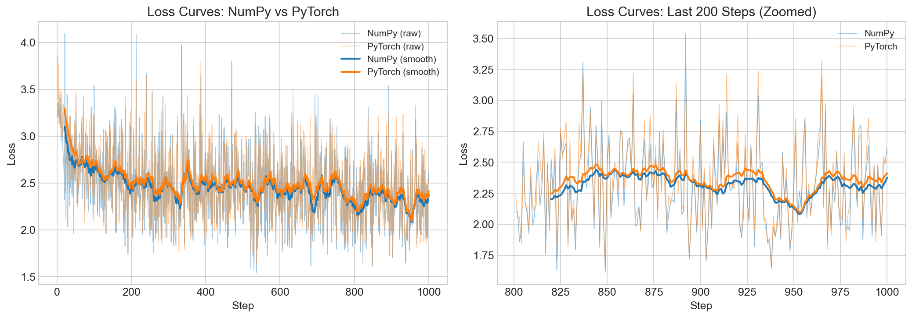
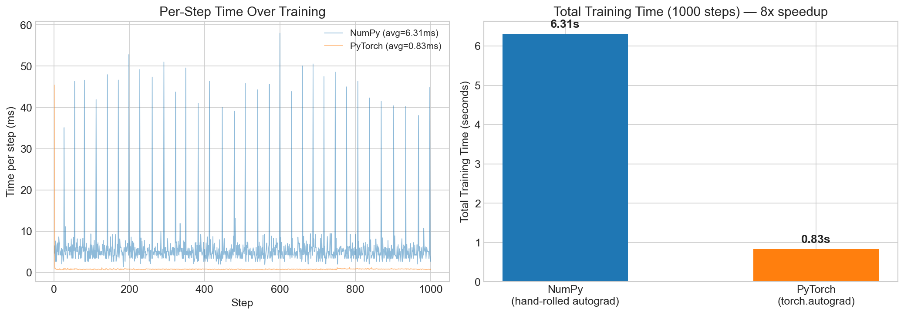

# 3. Autograd with PyTorch

## What We Do Here

In [Step 2](../2.%20vectorise%20with%20numpy/), we vectorized the scalar Python GPT using NumPy arrays — but we still wrote our own autograd engine (a `Tensor` class that records backward closures and does topological-sort reverse-mode differentiation).

In this step, we **replace the hand-rolled autograd with PyTorch**. This means:

- `torch.autograd` handles gradient computation (C++ computation graph, no Python closures)
- `torch.optim.AdamW` replaces our hand-coded Adam loop
- `nn.Module` / `nn.Linear` / `nn.Embedding` replace manual parameter management
- `F.cross_entropy` replaces manual softmax + `-log(prob[target])`
- The forward pass processes the **full sequence at once** via batched matmul + a causal mask, rather than looping token-by-token with a KV cache

The model architecture is the same: `n_embd=16, n_head=4, n_layer=1, block_size=16`.

## What Changed

| Aspect | NumPy (Step 2) | PyTorch (Step 3) |
|--------|---------------|------------------|
| Autograd | Hand-rolled `Tensor` class with backward closures | `torch.autograd` (C++ engine) |
| Forward pass | Token-by-token loop with KV cache | Full sequence via batched matmul |
| Attention | Python loops over heads + positions | Single batched matmul + causal mask |
| Optimizer | Hand-coded Adam on numpy arrays | `torch.optim.AdamW` (fused C++) |
| Loss | Manual softmax + `-log(prob[target])` | `F.cross_entropy` (fused kernel) |
| Modules | Flat functions + dict of arrays | `nn.Module` hierarchy |

## How It Improved

### Performance Results

| Metric | NumPy | PyTorch | Improvement |
|--------|-------|---------|-------------|
| Avg time per step | 6.31ms | 0.83ms | **~8x faster** |
| Total training (1000 steps) | 6.31s | 0.83s | **~8x faster** |
| Final loss | 2.61 | 2.52 | Slightly better |
| Parameters | 4,192 | 4,240 | +48 (RMSNorm scale) |

The slight param count difference (4,240 vs 4,192) is because PyTorch's RMSNorm uses a learnable `scale` parameter (`nn.Parameter(torch.ones(dim))`), adding 48 params (3 RMSNorm layers x 16 dims). The NumPy version uses a fixed scale of 1.

### Loss Curves

Both converge similarly — same architecture, same data, same hyperparameters:



### Time Comparison



PyTorch's per-step time is rock-steady at ~0.8ms. The NumPy version averages ~6ms but has periodic spikes up to 50ms (likely due to Python garbage collection of the computation graph closures).

## Why Another ~8x?

The speedup comes from:

1. **C++ autograd engine**: PyTorch's computation graph is built and traversed in C++, not Python. No Python closures, no `set()` for visited nodes, no Python-level topological sort.

2. **Batched sequence processing**: The NumPy version loops over each token position in Python (KV-cache style). PyTorch processes all positions at once via a single `(B, T, C)` tensor and a causal mask.

3. **Fused operations**: `F.cross_entropy` computes log-softmax and NLL loss in a single fused kernel. The NumPy version does softmax, indexing, and log as separate operations.

4. **Optimized Adam**: `torch.optim.AdamW` is implemented in C++ with fused updates. The NumPy version loops over parameters in Python.

### Cumulative Speedup Across the Series

| Step | Implementation | Time (1000 steps) | Speedup vs Previous | Cumulative Speedup |
|------|---------------|-------------------|---------------------|--------------------|
| 1 | Pure Python | ~51s | — | 1x |
| 2 | NumPy vectorized | ~6.3s | 8x | 8x |
| 3 | PyTorch autograd | ~0.83s | 8x | **~61x** |

## How to Run

```bash
# From the project root
source venv/bin/activate

# Run the PyTorch version standalone
cd "3. autograd with pytorch"
python main.py

# Run the comparison notebook
jupyter notebook run.ipynb
```

## Files

- `main.py` — PyTorch MicroGPT (`nn.Module` based, `torch.autograd`, `AdamW`)
- `run.ipynb` — Comparison notebook (runs both Step 2 and Step 3, generates plots)
- `results_pytorch.json` — Cached benchmark results
- `loss_curves.png` / `time_comparison.png` / `architecture_comparison.png` — Generated plots
