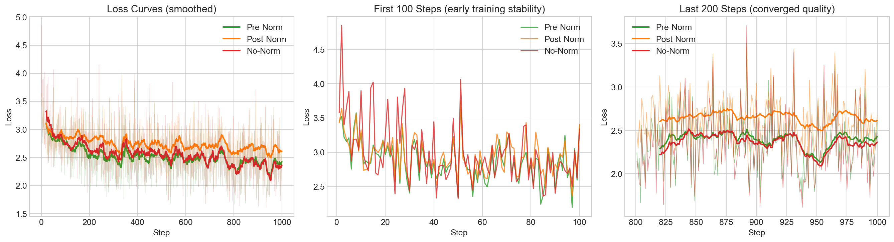
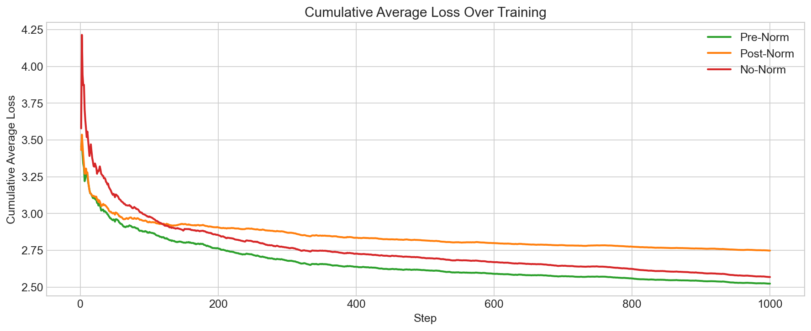

# 4. Why Normalise Before

## What We Do Here

[Step 3](../3.%20autograd%20with%20pytorch/) uses **Pre-Norm**: normalization is applied *before* each sub-layer (attention, MLP). This is the modern default used by GPT-2, LLaMA, and most recent LLMs.

But the original Transformer from ["Attention is All You Need" (Vaswani et al. 2017)](https://arxiv.org/abs/1706.03762) used **Post-Norm**: normalization *after* the residual addition. Why did the field switch?

This step answers that question experimentally. We train three 8-layer transformers with identical hyperparameters (and no learning rate warmup) to compare:

```
Pre-Norm (modern)              Post-Norm (original)           No-Norm
─────────────────              ────────────────────           ───────
        x                              x                        x
        │                              │                        │
   ┌────┴────┐                    ┌────┴────┐             ┌────┴────┐
   │  Norm   │                    │  Attn   │             │  Attn   │
   │  Attn   │                    │    +    │             │    +    │
   └────┬────┘                    │  Norm   │             └────┬────┘
        + (residual)              └────┬────┘                  │
        │                              │                       │
   ┌────┴────┐                    ┌────┴────┐             ┌────┴────┐
   │  Norm   │                    │  MLP    │             │  MLP    │
   │  MLP    │                    │    +    │             │    +    │
   └────┬────┘                    │  Norm   │             └────┬────┘
        + (residual)              └────┬────┘                  │
        │                              │                       │
   Final Norm                     (no final norm)         (no final norm)
        │                              │                       │
     lm_head                        lm_head                 lm_head
```

## Key Paper

> **"On Layer Normalization in the Transformer Architecture"**
> Xiong et al. 2020 — [arxiv.org/abs/2002.04745](https://arxiv.org/abs/2002.04745)
>
> This paper proves that Pre-Norm transformers have well-behaved gradients at initialization and don't require learning rate warmup, while Post-Norm transformers can diverge without careful warmup schedules.

## Results

All three variants use `n_embd=16, n_head=4, n_layer=8, block_size=16`, trained for 1000 steps with Adam (lr=0.01, linear decay, **no warmup**).

### Performance Comparison

| Metric | Pre-Norm | Post-Norm | No-Norm |
|--------|----------|-----------|---------|
| Parameters | 25,968 | 25,952 | 25,696 |
| Avg loss (first 50 steps) | **2.95** | 2.99 | 3.11 |
| Avg loss (last 100 steps) | **2.36** | 2.62 | 2.32 |
| Max loss (first 20 steps) | 3.58 | 3.64 | **4.85** |
| Min loss seen | 1.67 | 1.97 | 1.61 |

### Loss Curves



**Left**: Smoothed loss over full training — Pre-Norm (green) converges fastest and most cleanly. Post-Norm (orange) lags behind. No-Norm (red) is noisy.

**Middle**: First 100 steps — No-Norm has wild spikes (loss hitting 4.85 at step 2), showing instability without normalization. Pre-Norm descends the most smoothly.

**Right**: Last 200 steps — Pre-Norm maintains the lowest smoothed loss.

### Cumulative Average Loss



The cumulative average clearly separates the three strategies. Pre-Norm leads from start to finish.

### Generated Samples

| # | Pre-Norm | Post-Norm | No-Norm |
|---|----------|-----------|---------|
| 1 | jarelh | jnirah | jerel |
| 2 | emaera | eoaeini | aerde |
| 3 | maia | **a** | jiia |
| 4 | anila | **a** | aryn |
| 5 | kana | **a** | anelin |

Post-Norm produces **degenerate single-character outputs** (`a, a, a`) — a classic sign that the model collapsed during training. Pre-Norm produces the most natural-sounding names.

## Why Pre-Norm Wins

1. **Gradient flow through residuals**: In Pre-Norm, the residual connection `x + f(Norm(x))` creates a clean gradient highway. The gradient can flow directly through the `+` without passing through normalization. In Post-Norm, `Norm(x + f(x))`, the gradient must pass through the norm layer, which can amplify or suppress it.

2. **No warmup needed**: Post-Norm's gradient magnitudes at initialization can be very large in deeper layers. The standard fix is learning rate warmup (start with a tiny lr, gradually increase). Pre-Norm doesn't need this — our experiments use no warmup at all, and Pre-Norm handles it fine.

3. **Stability at depth**: With 8 layers and no warmup, Post-Norm's training becomes unstable enough to produce degenerate outputs. The no-norm model is even worse — loss spikes to 4.85 in the first few steps. Pre-Norm stays stable throughout.

## How to Run

```bash
source venv/bin/activate
cd "4. why normalise before"

# Run all three experiments
python main.py

# Open the comparison notebook
jupyter notebook run.ipynb
```

## Files

- `main.py` — Runs all three experiments (pre-norm, post-norm, no-norm) with configurable `MicroGPT(norm_type=...)`
- `run.ipynb` — Comparison notebook with loss curves, cumulative averages, samples
- `results_prenorm.json` / `results_postnorm.json` / `results_nonorm.json` — Cached results
