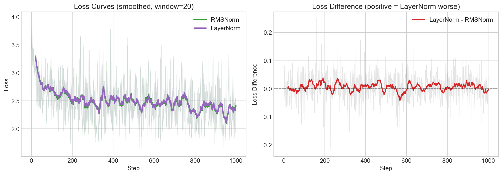
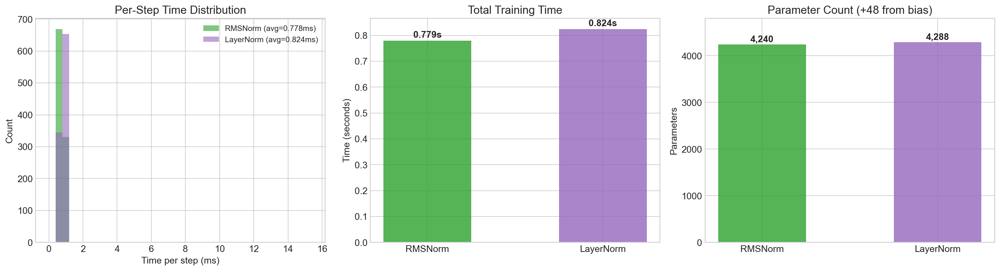

# 5. Why Not LayerNorm

## What We Do Here

[Step 3](../3.%20autograd%20with%20pytorch/) uses **RMSNorm** instead of the more traditional **LayerNorm**. This step asks: why? We train the same GPT architecture with each normalization method and compare.

### The Two Methods

```
LayerNorm (Ba, Kiros & Hinton 2016)       RMSNorm (Zhang & Sennrich 2019)
────────────────────────────────           ─────────────────────────────────
x = [x₁, x₂, ..., xₙ]                    x = [x₁, x₂, ..., xₙ]

μ = mean(x)          ← compute mean       (skip)
x = x - μ            ← center to zero     (skip)
σ² = var(x)          ← compute variance   ms = mean(x²)   ← just mean of squares
x = x / √(σ² + ε)   ← normalize          x = x / √(ms + ε)
out = γ·x + β        ← scale + bias       out = γ·x       ← scale only
     ↑   ↑                                      ↑
   learned (2n params)                     learned (n params)
```

RMSNorm drops two things:
1. **Mean centering** — no `x - mean(x)` step (saves one reduction + subtraction)
2. **Learned bias** — no `β` parameter (saves `n` params per norm layer)

### Key Papers

- **LayerNorm**: ["Layer Normalization"](https://arxiv.org/abs/1607.06450) — Ba, Kiros & Hinton 2016
- **RMSNorm**: ["Root Mean Square Layer Normalization"](https://arxiv.org/abs/1910.07467) — Zhang & Sennrich 2019

The RMSNorm paper shows that the re-centering (mean subtraction) in LayerNorm is not essential — the re-scaling alone provides sufficient normalization for stable training, and removing the mean computation gives a speed boost.

## Results

Both use the same Pre-Norm GPT: `n_embd=16, n_head=4, n_layer=1, block_size=16`, trained for 1000 steps.

### Performance Comparison

| Metric | RMSNorm | LayerNorm |
|--------|---------|-----------|
| Parameters | 4,240 | 4,288 (+48) |
| Avg loss (last 100 steps) | **2.325** | 2.329 |
| Avg step time | **0.80ms** | 0.83ms |
| Total training time | **0.80s** | 0.84s |
| LayerNorm overhead | — | +5% |

### Loss Curves



**Left**: The smoothed loss curves are nearly identical — both methods achieve the same final quality. **Right**: The per-step loss difference (LayerNorm − RMSNorm) fluctuates around zero with no consistent winner.

### Timing



RMSNorm is slightly faster per step. The 48 extra parameters in LayerNorm come from the bias vectors in each norm layer (3 norm layers × 16 dims = 48).

## Why Use RMSNorm?

At this tiny scale (16-dim embeddings), the differences are marginal. The real argument for RMSNorm emerges at scale:

1. **Fewer operations per token**: Dropping the mean computation saves one full reduction over the embedding dimension. For a 4096-dim model processing billions of tokens, this adds up to meaningful wall-clock savings.

2. **Fewer parameters**: No bias vectors means fewer params to store, communicate (in distributed training), and update. At GPT-3 scale (96 layers × 12288 dims), this saves ~2.4M parameters.

3. **Same quality**: The RMSNorm paper demonstrates empirically that mean-centering doesn't help — the scale normalization does all the work. Our experiment confirms this: the loss curves are indistinguishable.

4. **Simpler code**: RMSNorm is 3 lines of math vs 5 for LayerNorm. Less code = fewer bugs.

This is why modern LLMs (LLaMA, Gemma, Mistral) use RMSNorm exclusively.

## How to Run

```bash
source venv/bin/activate
cd "5. why not layernorm"

python main.py              # run both experiments
jupyter notebook run.ipynb  # open comparison notebook
```

## Files

- `main.py` — Runs RMSNorm and LayerNorm experiments with configurable `norm_cls`
- `run.ipynb` — Comparison notebook with loss curves, timing, and samples
- `results_rmsnorm.json` / `results_layernorm.json` — Cached results
